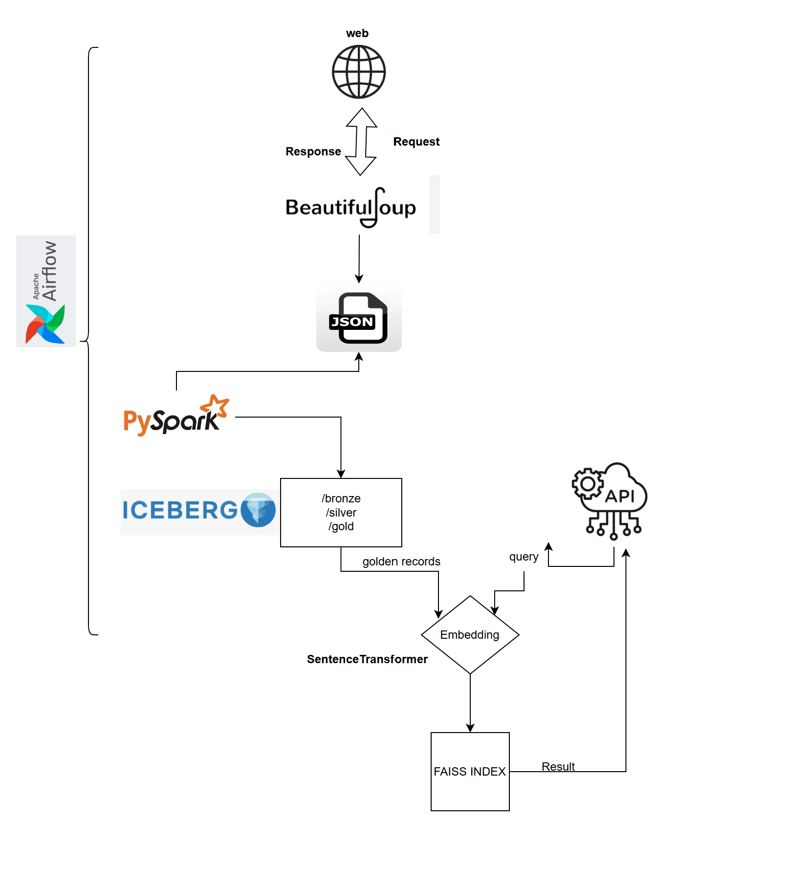

# Data-Scrape-to-RAG

A mini end-to-end **Lakehouse** pipeline demonstrating a complete flow from **web scraping** to **Retrieval-Augmented Generation (RAG)**.

---

##  Introduction

This project performs the following steps:

1. **Scrape a website** to collect unstructured content.
2. **Transform the data** into a structured relational format.
3. **Store** the structured data in a MinIO data lake.
4. **Create intermediate state** using Apache Spark.
5. **Compute sentence embeddings** using `sentence-transformers`.
6. **Build a FAISS index** for semantic search.
7. **Save the FAISS index** to local disk.
8. **Launch a FastAPI server** that allows users to query the scraped data using semantic search.

---

##  Architecture


---

##  Working

- Apache Airflow orchestrates the complete scraping and processing pipeline.
- MinIO acts as S3-compatible object storage.
- FAISS enables fast semantic similarity search.
- FastAPI exposes an interface to interact with the FAISS index.

---

##  Deployment Guideline

### Step 1: Start All Containers
```bash
docker-compose up
```
- **Airflow UI**: [http://localhost:8081/](http://localhost:8081/)
- **MinIO Console**: [http://localhost:9001/browser](http://localhost:9001/browser)

---

### Step 2: Create Airflow Web Server User
```bash
docker exec -it airflow-webserver bash

airflow users create \
  --username admin \
  --firstname Admin \
  --lastname User \
  --role Admin \
  --email admin@example.com \
  --password admin
```

---

### Step 3: Create MinIO Bucket

Use the console or AWS CLI to create a bucket (e.g. `data-lake`) matching the value in your `config.json`.

---

### Step 4: Setup SSH Access to Notebook Container
```bash
docker exec -it notebook bash
bash /home/docker/notebooks/setup_ssh.sh
```

---

### Step 5: Add Airflow SSH Connection to Notebook

In the Airflow UI, add a new SSH connection:
- **Conn Type**: SSH
- **Host**: `notebook`
- **Port**: `22`
- **Login**: `docker` (or as configured)

---

### Step 6: Fill Configuration

Edit `config.json` (Example):

```json
{
  "BASE_URL": "<URL to scrape>",
  "pages_to_scn": 3,
  "NESSIE_URI": "http://nessie:19120/api/v1",
  "MINIO_ENDPOINT": "http://minio:9000",
  "MINIO_ACCESS_KEY": "admin",
  "MINIO_SECRET_KEY": "******",
  "local_vloume": "/home/docker/notebooks/data",
  "minio_bucket": "data-lake"
}
```

---

### Step 7: Trigger Airflow DAG

Use Airflow UI to **unpause** and **trigger** the DAG that performs the scraping and processing.

---

### Step 8: Start the FastAPI Server
```bash
docker exec -it notebook bash
/home/docker/notebooks/up_fast_api.sh
```

---

###  Example Request

Query your FAISS-powered FastAPI endpoint:

```
GET http://localhost:10000/ask?question=book&numres=5
```

---

##  Stack Summary

| Component | Role |
|----------|------|
| Jupyter Notebook | Development environment |
| Apache Airflow | Pipeline orchestration |
| Apache Spark | Intermediate transformation |
| MinIO | Object storage |
| Sentence Transformers | Embedding generation |
| FAISS | Vector similarity search |
| FastAPI | Search endpoint for querying embeddings |

---